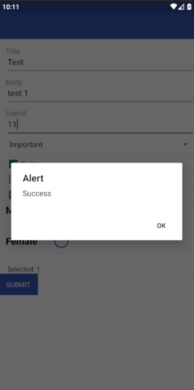
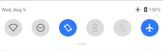
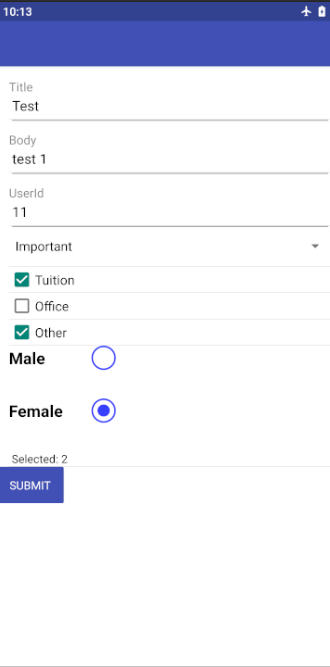
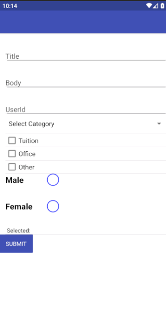

# Form App

## Introduction

Form app is form application like usually but this app can saved your input to application storage if you don't have internet connection, so if you open the app again when your device connected you just send your data without input again.

This app use [async storage](https://github.com/react-native-community/async-storage) library to save your data to application storage, This an example :

**Firstly**

just import the library

`import AsyncStorage from '@react-native-community/async-storage'; `

**Secondly**

save data to storage using `setItem()` function

```javascript

//check if device connected or not using netInfo library
NetInfo.fetch().then(state => {
    if(state.isConnected){
        //send data to server
        this.props.postToServer(this.state.data)
        //remove the data in async storage if data has sent successfully
        AsyncStorage.remove('your storage key')
    }else{
    //save to async storage
    let data = {
    key : your data
    }

    AsyncStorage.setItem('your storage key', JSON.stringfy(data))
}
})


```

**Thirdly**

if you have saved the data successfully, now get data from storage use `getItem()` function and then put to state so that we can call the data in our component.

```javascript
//put the data in some variable
const getData = AsyncStorage.getItem('your storage key')
//check if data null or not and then parse it
if(getData !== null){
    const parseData = JSON.parse(getData)
    //put into state
    this.setState({yourState: getData.key })
}

```

**Last**

Set your state to component and now our data will be saved in application storage even your kill the app from memory the data still there is.

## Screenshot

If device connected to internet the data will be sent

 

Now we can test if device is disconnect and send the data



Yup, the data still showing and just re-send the data if device connect to internet



And then if the data has successfully sent, the data will be remove from application storage



## Preview

